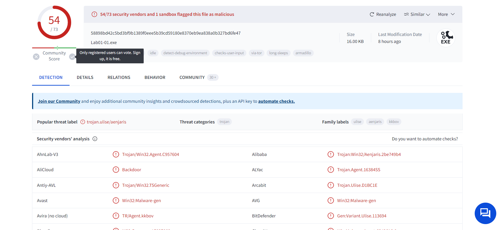
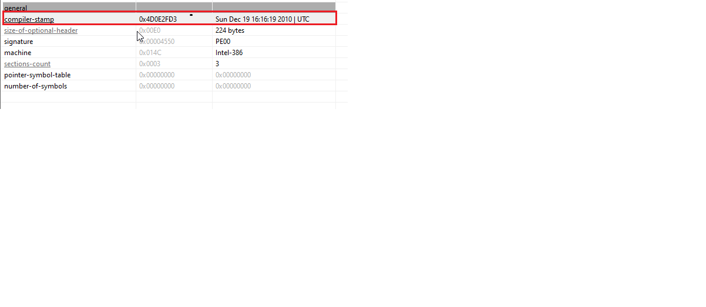
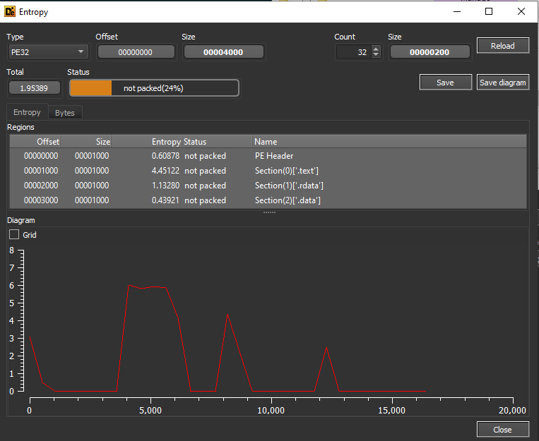
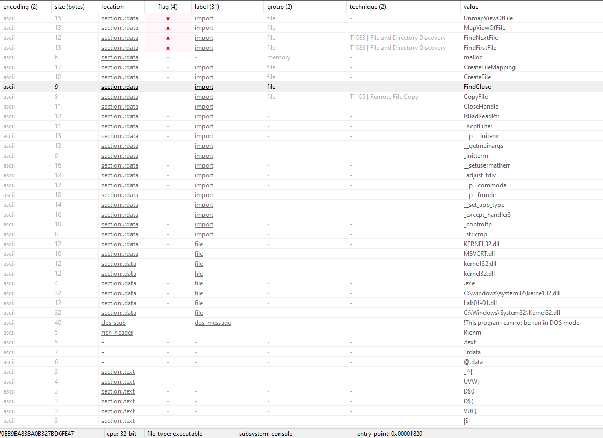
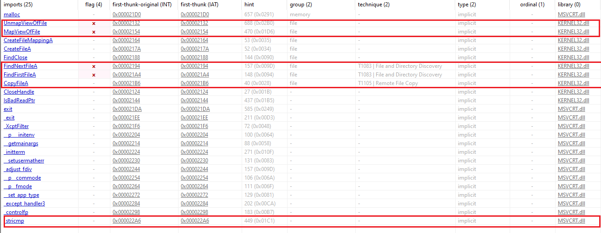
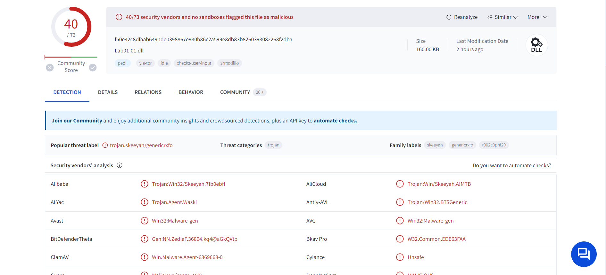
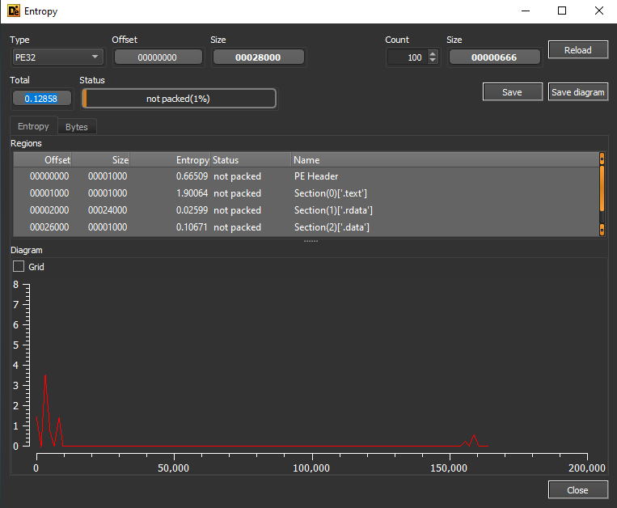
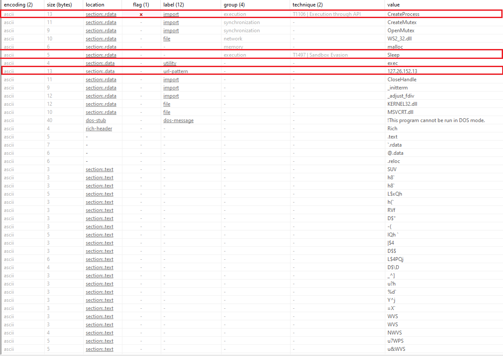

# Lab01_01 Analysis
## Solutions: 
**(1)** 54/73 security vendors flagged this file as malicious.   
**(2)** This file compiled at  Sun Dec 19 16:16:19 2010 | UTC   
**(3)** the file is not packed.   
**(4)** Allocate memory, map a file and secrch for file    
**(5)** There are 4 IOCs extracted in our report    
**(6)** There are no Network IOCs.  
**(7)** I guess That file is a `Dropper`  
## Analysis:
### Virus Total:
54/73 security vendors flagged this file as malicious.

### Time Date stamp:
This file compiled at  Sun Dec 19 16:16:19 2010 | UTC

### indicators of packer :
#### First indicator :
we found that file is not packed with low entropy `1.95389`
             
           

#### Second indicators :
we found that file has a lot of strings which indicates that file is not packed           
       

#### Third indicator :
we found that file has a lot of imports which indicate that the file is not packed         

      
                 
### imports indications :
we found that the file call `MapViewOfFile` and  `UnmapViewOfFile` which Maps a view of a file mapping into the address space of a calling process then unmap it.
`FindFirstFileA` and `FindNextFileA` which means ti search for specific file.
### Host-based IOCs :

| Num | Type | VAlue |
| :---: | :---: | :---: |
| 1 | FileName |Lab01-01.dll | 
| 2 | Filepath |C:\Windows\System32\Kernel32.dll | 
| 3 | SHA-256 Hash |F50E42C8DFAAB649BDE0398867E930B86C2A599E8DB83B8260393082268F2DBA |
| 4 | SHA-256 |7532476D0AEFD9A8EBB699ABF1010651645402FC0A56A681191CC2DABDFB5BE7 |  
### Network-based IOCs :
There is no Network based IOCs.
### summary :
> From  all extracted data we found Lab01-01.exe is a dropper which drops Lab01-01.dll in disk then executes it.                                                                                  

# Deep look on Lab01-01.dll
# Lab01-01.dll Analysis
## Solutions: 
**(1)** 40/73 security vendors and no sandboxes flagged this file as malicious.     
**(2)** This file compiled at Sun Dec 19 16:16:38 2010 | UTC.      
**(3)** the file is not packed.    
**(4)** Open sockets,connect URL,sleep,send and receive files .     
**(5)** There is 1 IOCs extracted in our report      
**(6)** There is 1 Network IOCs in our report .    
**(7)** I guess That file is a `Backdoor`   
## Analysis:  
### Virus Total:
40/73 security vendors and no sandboxes flagged this file as malicious.  

### Time Date stamp:
This file compiled at Sun Dec 19 16:16:38 2010 | UTC.

### indicators of packer :

#### First indicator :
we found that file is not packed with low entropy `0.12858`  
             
   

#### Second indicators :
we found that file has a lot of strings which indicate that file is not packed.  

       

#### Third indicator :
we found that file has a lot of imports which indicate that the file is not packed .          

     
                 
### imports indications :
> open socket,connect to URL and receive packets
> Create a child process
> Create a Mutex 
> Sleeping 
### Host-based IOCs :

| Num | Type | Value |
| :---: | :---: | :---: |
| 1 | SHA-256 Hash |f50e42c8dfaab649bde0398867e930b86c2a599e8db83b8260393082268f2dba | 

### Network-based IOCs :
| Num | Type | Value |
| :---: | :---: | :---: |
| 1 | IP Address |127.26.152.13 | 
 

### summary :
> `**From  all extracted data we found Lab01-01.exe is a dropper which drops Lab01-01.dll which is a Backdoor and It connects to URL through the IP Address 127.26.152.13 then send and receive files.**`
