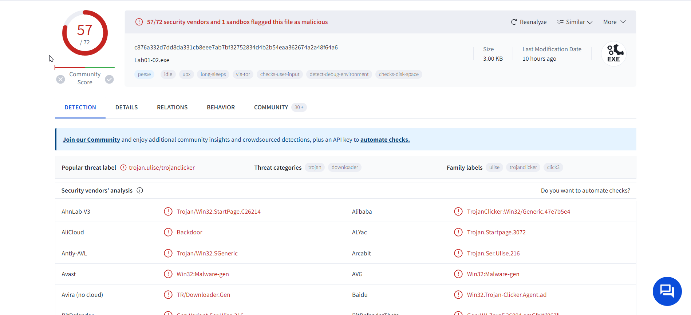
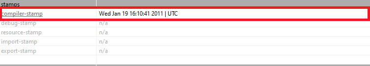
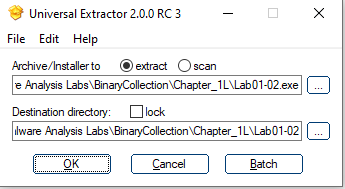
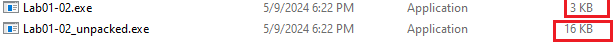
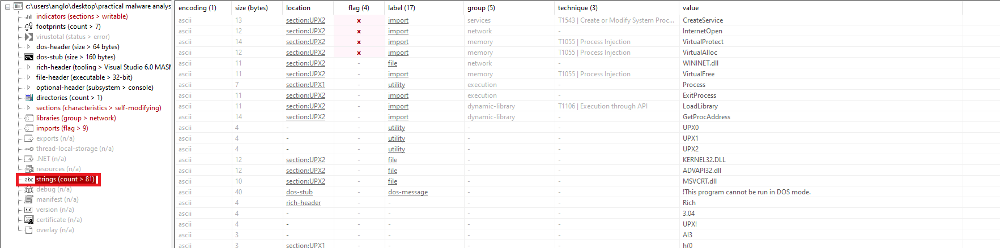
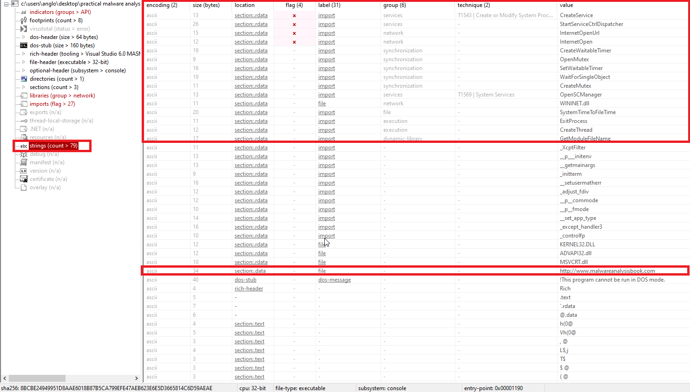
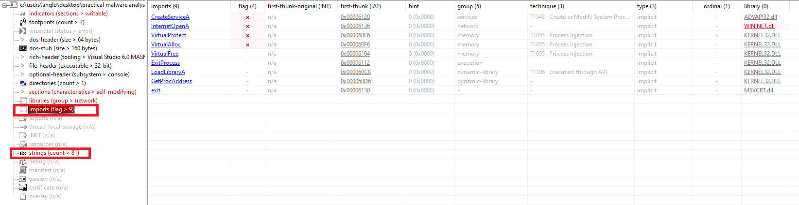
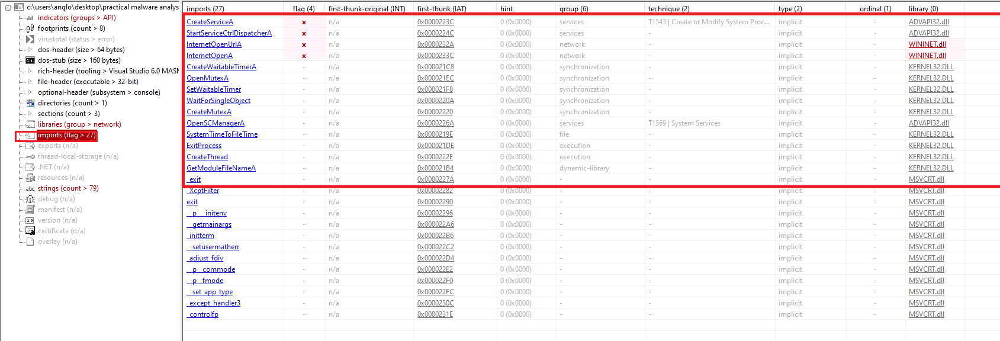

# Lab01_02 Analysis
## Solutions: 
**(1)** 57/72 security vendors and 1 sandbox flagged this file as malicious.                   
**(2)** This file compiled at Wed Jan 19 16:10:41 2011 | UTC.             
**(3)** the file is not packed/ packed .   
**(4)** .................    
**(5)** There are 1 IOCs extracted in our report    
**(6)** There are 2 Network IOCs in our report .  
**(7)** I guess That file is a `Backdoor`  
## Analysis:
### Virus Total:
57/72 security vendors and 1 sandbox flagged this file as malicious.     

### Time Date stamp:
This file compiled at Wed Jan 19 16:10:41 2011 | UTC.   
     

### indicators of packer :
 
 ### Defeat packers 
 > we found there is a UPX signature        
 > we used `UniExtract Tool`  

      

 > we found a result :

 

#### First indicator :
we found that file is not packed  with low entropy `5.25021` expect `Section(1)` is packed with high Entropy ``
             
          

#### Second indicators :
we found that file has a lot of  strings but we found that is one section is packed so that there are more informations embedded  in this section we will discover.       

Packing Strings            |  Unpacking Srings
:-------------------------:|:-------------------------:
  |  

#### Third indicator :
we found that file has a few imports which indicate that the file is  packed and we found the packed sections.   

Packing Imports     |  Unpacking Imports
:-------------------------:|:-------------------------:
  |  
     

                 
### imports indications :
> Create and Strat a service.         

> Connect to Internet.       

> Create a Mutex                

> Sleeping

### Host-based IOCs :

| Num | Type | Value |
| :---: | :---: | :---: |
| 1 | SHA-265 Hash |8BCBE24949951D8AAE6018B87B5CA799EFE47AEB623E6E5D3665814C6D59AEAE| 
| 2 | SHA-256 hash  |C876A332D7DD8DA331CB8EEE7AB7BF32752834D4B2B54EAA362674A2A48F64A6 | 

### Network-based IOCs :
| Num | Type | Value |
| :---: | :---: | :---: |
| 1 | URL |http://www.malwareanalysisbook.com | 
 

### summary :
From  all extracted data we found Lab01_02 is inpacker form so we unpacked it using UPX , in unpacked version ,we found a lot of functionalies as open a service to esclate privileges,conncet to internet and using sleeping mechanism.
