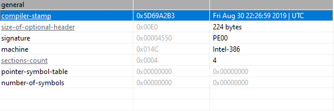
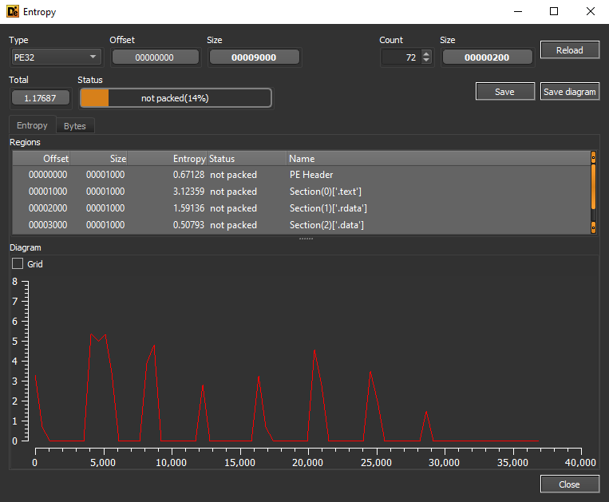
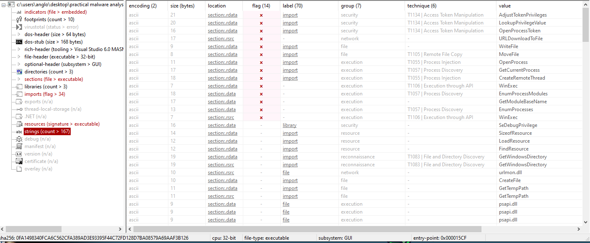
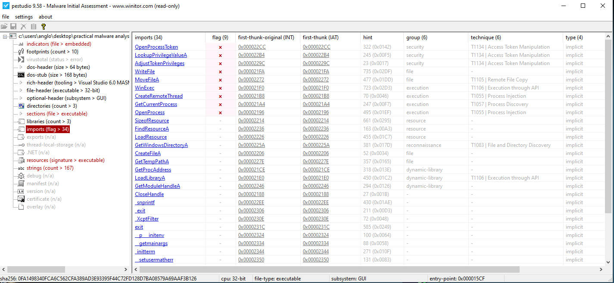

# Lab01-04.exe Analysis
## Solutions: 
**(1)** 60/72 security vendors flagged this file as malicious.   
**(2)** This file compiled at Fri Aug 30 22:26:59 2019 | UTC.
**(3)** the file is not packed.   
**(4)** .................    
**(5)** There are ..... IOCs extracted in our report    
**(6)** There are ..... Network IOCs in our report .  
**(7)** I guess That file is a `.......`  
## Analysis:
### Virus Total:
60/72  security vendors flagged this file as malicious.

           

 
### Time Date stamp:
This file compiled at Fri Aug 30 22:26:59 2019 | UTC

              

### indicators of packer :

#### First indicator :
we found that file is not packed with low entropy `1.17687`

    
             
          

#### Second indicators :
we found that file has a lot of strings which indicate that file is not packed.    

              

       

#### Third indicator :
we found that file has a lot of imports which indicate that the file is not packed.       

                  

                 

### Host-based IOCs :

| Num | Type | Value |
| :---: | :---: | :---: |
| 1 | SHA-256 Hash  |0FA1498340FCA6C562CFA389AD3E93395F44C72FD128D7BA08579A69AAF3B126 | 
| 2 | path | \system32\wupdmgr.exe | 
| 3 | path  |\system32\wupdmgrd.exe|

### Network-based IOCs :
| Num | Type | Value |
| :---: | :---: | :---: |
| 1 | URL |http://www.practicalmalwareanalysis.com/updater.exe | 

